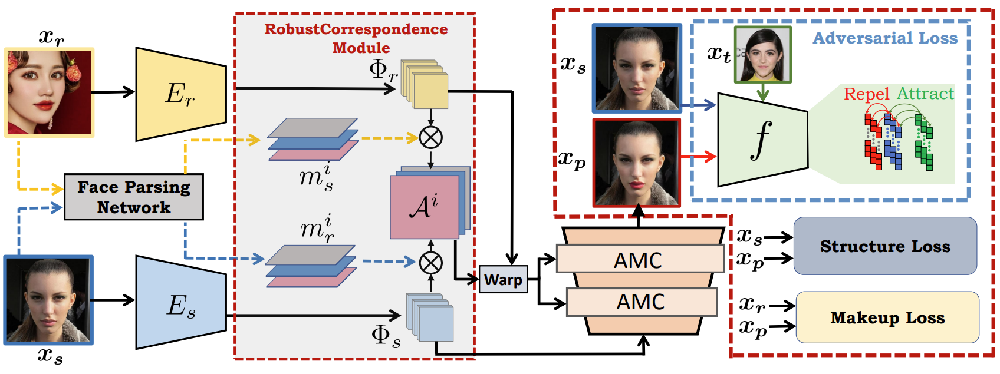

# Makeup-Guided Facial Privacy Protection via Untrained Neural Network Priors [ECCVW 2024]

    

> [**Makeup-Guided Facial Privacy Protection via Untrained Neural Network Priors**](https://github.com/fahadshamshad/deep-facial-privacy-prior) 
> [Fahad Shamshad](https://fahadshamshad.github.io/), [Muzammal Naseer](https://muzammal-naseer.com/), and [Karthik Nandakumar](https://scholar.google.com.pk/citations?user=2qx0RnEAAAAJ&hl=en)
>
> **Mohamed bin Zayed University of AI**
>
> 
>
> ---
>
> # :rocket: Release
* **(August 21, 2024)**
  * Paper uploaded on arXiv.
 
## Pipeline

**Deep Facial Privacy Prior** generates face images that look natural and real. **But here's the special part**: it also ensures a high level of privacy protection. This means you can keep sharing images without worrying about unwanted tracking. 

  

